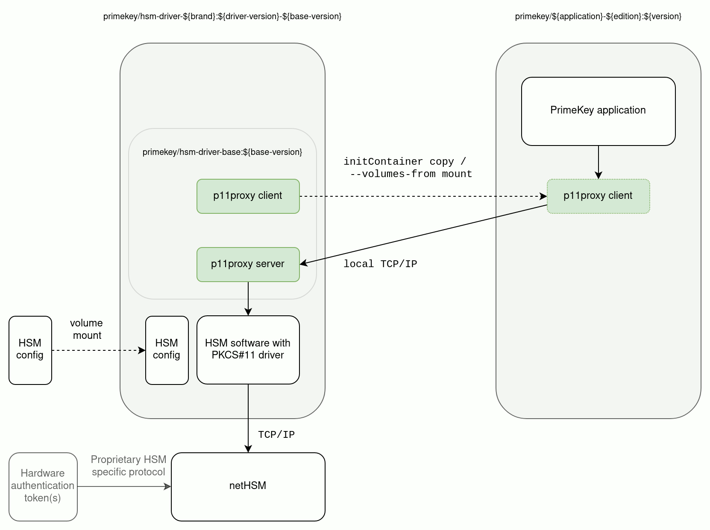

# Side-car pattern for Hardware Security Module (HSM) integration

EE application users can leverage a proprietary module packaged as a container to invoke the HSM specific PKCS#11 library over (Pod-local) network.

<a href="hsm-driver-pattern.png"></a>

This enables rolling updates of either hsm-driver or application container without the risk of application container library changes breaking the HSM driver.

See the provided `docker-compose.yml` for an example of how to use a net-HSM (mocked by SoftHSMv2) with EJBCA:

```
docker-compose up --build
```

For Kubernetes/Openshift the `docker-compose` example corresponds to:

```
apiVersion: apps/v1
kind: Deployment
...
spec:
  template:
    spec:
      initContainers:
      - name: hsm-driver-init
        image: registry.primekey.com/primekey/hsm-driver-softhsm:0.4.20
        command: ['sh', '-c', 'cp --preserve --recursive /opt/primekey/p11proxy-client/* /mnt/']
        volumeMounts:
        - name: p11proxy-client
          mountPath: /mnt
      containers:
      - name: hsm-driver
        image: registry.primekey.com/primekey/hsm-driver-softhsm:0.4.20
        ...
        env:
        - name: SOFTHSM2_LOG_LEVEL
          value: INFO
        ...
      - name: application
        image: registry.primekey.com/primekey/ejbca-ee:7.7.0
        ...
        volumeMounts:
        - name: p11proxy-client
          mountPath: /opt/primekey/p11proxy-client
        ...
      volumes:
        - name: p11proxy-client
          emptyDir: {}
```
